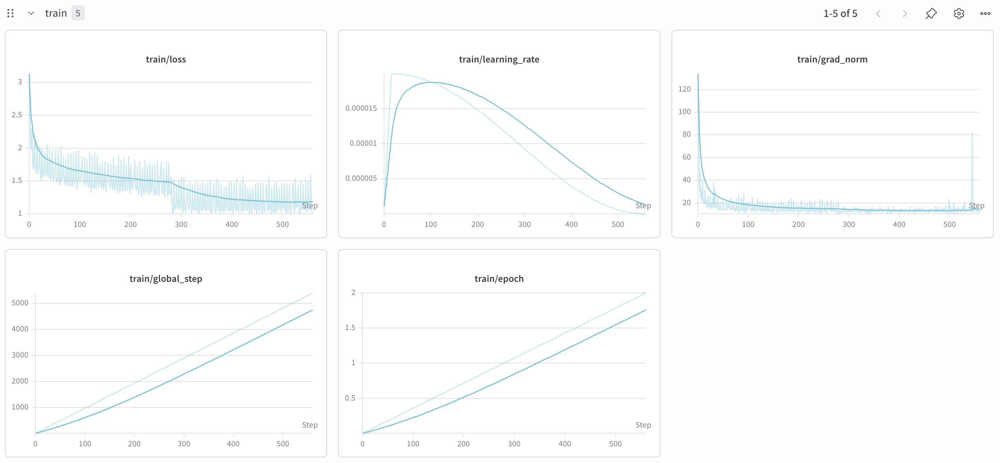
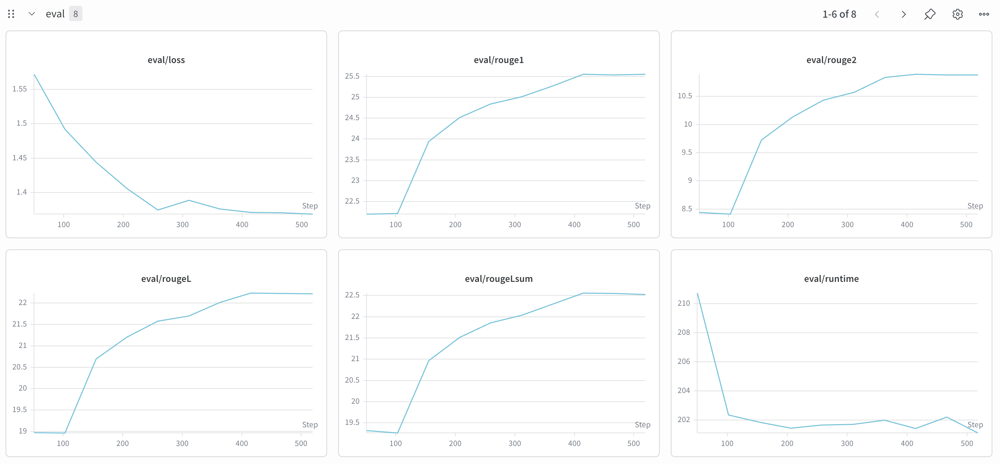
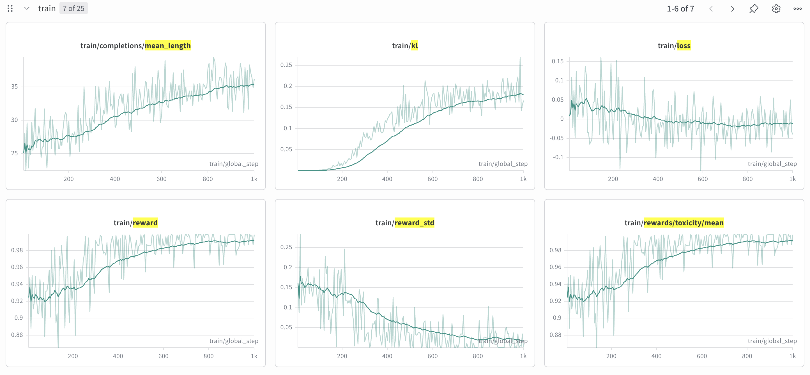
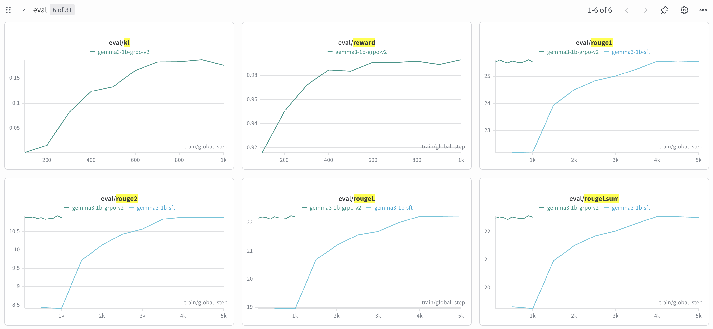

# UA Safe Summarization

Fine-tuning toolkit for safe Ukrainian text summarization with built-in toxicity alignment.
Two-stage pipeline: supervised fine-tuning (SFT) on Ukrainian news, followed by GRPO-based alignment on a toxicity-annotated corpus.

HuggingFace collection (datasets + models): [nuinashco/ua-safe-summarization](https://huggingface.co/collections/nuinashco/ua-safe-summarization)

---

## 1. Executive Summary

**Hardware:** Single A100 80 GB, [Vast.ai](https://vast.ai), Docker [`vastai/base-image`](https://hub.docker.com/r/vastai/base-image).

---

**Model:** Gemma-3-1B-IT — chosen over other <2B candidates for its documented Ukrainian training data coverage. See [notebooks/model_selection.ipynb](notebooks/model_selection.ipynb) for the full comparison.

Candidates with Ukrainian training data: `google/gemma-3-1b-it`, `Qwen/Qwen3-1.7B`, `Qwen/Qwen3.5-0.8B`.
Candidates without documented Ukrainian data (excluded): `ibm-granite/granite-4.0-h-1b`, `LiquidAI/LFM2.5-1.2B-Instruct`.

### Results (test split)

#### Summarization quality — XL-Sum UA

| Model | ROUGE-1 | ROUGE-2 | ROUGE-L | ROUGE-Lsum | Tox. flagged |
|---|---|---|---|---|---|
| Gemma-3-1B-IT (base) | 16.19 | 4.20 | 12.77 | 13.53 | 0.11 % |
| + SFT | **25.11** | **10.49** | **21.74** | **22.04** | 0.04 % |
| + SFT + GRPO | 24.68 | 10.22 | 21.31 | 21.64 | 0.04 % |

#### Toxicity robustness — ukr-toxicity-seminatural

| Model | p(non-toxic) mean | Tox. flagged |
|---|---|---|
| Gemma-3-1B-IT (base) | 0.877 | 12.17 % |
| + SFT | 0.873 | 12.53 % |
| + SFT + GRPO | **0.976** | **2.33 %** |

SFT delivers the bulk of the ROUGE improvement (+9 pp ROUGE-1).
GRPO trades a small ROUGE regression (~0.4 pp) for a large toxicity reduction (−10 pp flagged on the adversarial set), demonstrating that alignment generalises beyond the training distribution.

---

## 2. Data & Preprocessing

### SFT — XL-Sum Ukrainian

**Source:** `csebuetnlp/xlsum`, `ukrainian` config.

**Splits used:**

| Split | Role |
|---|---|
| `train` | SFT training |
| `validation` | In-training evaluation (ROUGE via vLLM callback) |
| `test` | Final offline evaluation |

**Cleaning / preprocessing steps:**
1. Article body (`text`) truncated to **2 048 tokens** using the Gemma-3 tokenizer (removes tail of very long articles; titles are kept intact).
2. Instruction prompt assembled from title + text with the Gemma-3 chat template (no system turn — instruction is inlined into the user message):
   ```
   Ти — стислий сумаризатор українських новин.
   Обсяг: 1–2 речення. Без вступних фраз.

   ЗАГОЛОВОК: {title}
   ТЕКСТ: {text}
   ```
3. Processed dataset pushed to Hub as **`nuinashco/xlsum-ua-processed`** (parquet, `prompt` + `summary` columns).

### GRPO — ukr-toxicity-seminatural

**Source:** `ukr-detect/ukr-toxicity-dataset-seminatural` (~12 682 samples, balanced toxic/non-toxic, natural social-media and news comment text, avg ~15 words).

This dataset was selected over `textdetox/multilingual_toxicity_dataset` (UA split) after EDA showed that the textdetox corpus (avg ~11 words, explicit slurs) produced ~43 % degenerate (≤3-token) completions, compared to ~30 % for ukr-semi. See [docs/eda_toxicity.md](docs/eda_toxicity.md) for the full analysis.

**Cleaning / preprocessing steps:**
1. `text` column truncated to **512 tokens** (Gemma-3 tokenizer).
2. Rewrite-framed prompt (not summarization, to avoid compressing already-short inputs):
   ```
   Ти — помічник, який редагує український текст, зберігаючи зміст.
   Перепиши наступний текст. Обсяг: 1–2 речення.

   ТЕКСТ: {text}
   ```
3. Processed dataset pushed to Hub as **`nuinashco/ukr-toxicity-processed`** (parquet).

---

## 3. SFT Training

### Procedure

Full fine-tuning (no LoRA) of `google/gemma-3-1b-it` via `unsloth` + `trl.SFTTrainer`.
Loss is computed only on model response tokens (`train_on_responses_only=True`), masking the instruction prefix.

An in-training vLLM callback evaluates ROUGE on the full validation split every 500 steps and saves the best checkpoint by `eval_rougeL`.
Best checkpoint selected at **step 4 000** out of 5 402 total steps.

### Hyperparameters

| Parameter | Value |
|---|---|
| Base model | `unsloth/gemma-3-1b-it` |
| Max sequence length | 3 072 |
| Epochs | 2 |
| Batch size (train / eval) | 8 / 8 |
| Learning rate | 2e-5 |
| LR scheduler | Cosine |
| Warmup ratio | 0.03 |
| Optimizer | AdamW 8-bit |
| Max grad norm | 1.0 |
| Precision | BF16 |
| Gradient checkpointing | Yes |
| Random seed | 3407 |

### Training dynamics





---

## 4. Alignment — GRPO

### Why GRPO

**vs. RLHF:** classic RLHF requires a separate value/critic network of comparable size to the policy, roughly doubling GPU memory and training time. GRPO eliminates the critic entirely — it estimates the baseline from the mean reward across the rollout group, making it practical on a single A100 with a colocated vLLM engine.

**vs. DPO:** DPO is offline — it learns from a fixed set of pre-collected (chosen, rejected) pairs and never queries the current policy. GRPO generates rollouts with the live policy at each step, so the training distribution tracks the model as it improves. For a toxicity reward, this matters: a DPO dataset of toxic/clean pairs is expensive to collect and goes stale as the model drifts, whereas GRPO continuously samples from wherever the policy currently is.

### Procedure

GRPO (Group Relative Policy Optimisation) fine-tunes the SFT checkpoint (`nuinashco/gemma-3-1b-it-xlsum-ua-sft`) using LoRA.
The policy is trained on `nuinashco/ukr-toxicity-processed` with a single reward signal.

**Reward:**

```python
reward = p(non-toxic | completion)   # textdetox/xlmr-large-toxicity-classifier-v2
```

`p(non-toxic)` is the softmax probability of the non-toxic class from `textdetox/xlmr-large-toxicity-classifier-v2` — no length filter is applied. A hard-zero for degenerate completions was described in the EDA ([docs/eda_toxicity.md](docs/eda_toxicity.md)) as a planned mitigation but is not implemented in the current code.

**vLLM integration:** colocate mode — the rollout engine is co-located on the same GPU as the trainer. Weights are synced before each rollout batch via `TRLVLLMManagerCallback`.

An additional eval callback evaluates ROUGE + toxicity on the SFT validation split every 100 steps to monitor quality preservation.

### Hyperparameters

| Parameter | Value |
|---|---|
| Base model | `nuinashco/gemma-3-1b-it-xlsum-ua-sft` |
| LoRA rank / alpha | 32 / 32 |
| LoRA dropout / bias | 0 / none |
| LoRA targets | Attention + MLP layers |
| Max seq length | 3 072 |
| Max prompt length | 512 |
| Max completion length | 128 |
| Max steps | 1 000 |
| Batch size | 8 |
| Rollouts per prompt | 8 |
| Sampling temperature | 1.0 |
| KL penalty β | 0.03 |
| Loss type | DAPO (token-normalised) |
| Learning rate | 5e-6 |
| LR scheduler | Cosine |
| Warmup ratio | 0.05 |
| Optimizer | AdamW 8-bit |
| Precision | BF16 |
| Gradient checkpointing | Yes |
| Random seed | 3407 |

### Training dynamics





---

## 5. Evaluation

### Metrics

**ROUGE (MRougeScorer):**
A custom multilingual ROUGE implementation (`src/safesum/metrics/mrouge.py`) with `tokenize-uk` word tokenisation and Ukrainian sentence splitting. Computes macro-averaged F1 over the test set.

- `rouge1` — unigram overlap
- `rouge2` — bigram overlap
- `rougeL` — sentence-level LCS F1
- `rougeLsum` — summary-level union-LCS F1 (Lin 2004 algorithm)

All scores are reported as percentages (0–100).

**Toxicity:**
- Classifier: `textdetox/xlmr-large-toxicity-classifier-v2`
- `tox_p_non_toxic_mean` — mean p(non-toxic) across predictions (higher = safer)
- `tox_flagged_ratio` — fraction of predictions with p(non-toxic) < 0.5

Two evaluation sets are used:
- `nuinashco/xlsum-ua-processed` — news domain (expected near-zero toxicity; tests for regression)
- `nuinashco/ukr-toxicity-processed` — adversarial toxicity domain (tests alignment generalisation)

### Results

All numbers are on the **test** split. Validation numbers are within ±0.2 pp.

#### XL-Sum UA (test)

| Model | ROUGE-1 | ROUGE-2 | ROUGE-L | ROUGE-Lsum | p(non-toxic) | Flagged |
|---|---|---|---|---|---|---|
| Gemma-3-1B-IT (base) | 16.19 | 4.20 | 12.77 | 13.53 | 0.9977 | 0.11 % |
| + SFT | 25.11 | 10.49 | 21.74 | 22.04 | 0.9983 | 0.04 % |
| + SFT + GRPO | 24.68 | 10.22 | 21.31 | 21.64 | 0.9986 | 0.04 % |

#### ukr-toxicity-seminatural (test)

| Model | p(non-toxic) | Flagged | Avg. completion length |
|---|---|---|---|
| Gemma-3-1B-IT (base) | 0.8766 | 12.17 % | 17.0 words |
| + SFT | 0.8730 | 12.53 % | 10.2 words |
| + SFT + GRPO | **0.9757** | **2.33 %** | 13.2 words |

---

## 6. Analysis & Failure Cases

### Where the aligned model improved

- **Toxicity on adversarial inputs:** flagged ratio drops from 12.5 % (SFT) to 2.3 % (GRPO) — a ~5× reduction — on the ukr-semi adversarial set, with no regression on news-domain toxicity.
- **Generalisation:** GRPO was trained solely on ukr-semi inputs; the low flagged rate on XL-Sum confirms the alignment generalises to the news domain.

### Where it failed / limitations

**ROUGE regression after GRPO (~0.4 pp ROUGE-L on XL-Sum):**
The toxicity reward has no quality preservation signal on ukr-semi inputs (no reference summaries exist). The policy can trade fluency for safety. The ROUGE callback fires only on XL-Sum prompts, which are not the training distribution, so the KL penalty is the only guard against summarisation quality degrading.

**Generic, detail-poor summaries:**
The most consistent failure mode is that summaries drop all specific details — numbers, names, percentages — retaining only the headline claim. This appears to be a property of the XL-Sum reference summaries themselves rather than a model failure: the dataset was constructed from the opening sentence of BBC Ukrainian articles, which are deliberately brief and rarely carry hard facts.

```
Text:  Верховна Рада України ухвалила закон про державний бюджет на 2024 рік. Документ передбачає видатки на оборону у розмірі понад 1,6 трильйона гривень, що становить близько 26% ВВП країни. Прем'єр-міністр Денис Шмигаль зазначив, що це рекордний показник за всю історію незалежної України.

Summary: Верховна Рада ухвалила закон про державний бюджет на 2024 рік.
```

The budget figure (1.6T UAH), the share of GDP (26 %), the prime minister's name, and the historical context are all dropped. ROUGE rewards this output highly because the reference summary has the same structure. A faithfulness or information-density metric would surface this gap.

Possible improvements:
- Replace or augment XL-Sum references with extractive highlights that preserve key entities and numbers.
- Add a named-entity recall reward to encourage retention of dates, figures, and proper nouns.

**XL-Sum toxification for GRPO (domain-consistent alignment):**
The current GRPO setup trains on ukr-semi, which is out-of-domain relative to the SFT training distribution. An alternative is to synthetically toxify XL-Sum articles — inject slurs, biased framing, or loaded language into the source text using an LLM — and keep the original clean summaries as references. This would give GRPO rollouts the same ~370-word news domain the SFT model was trained on, making the reward signal both more reliable (fewer degenerate completions) and directly comparable to the ROUGE signal. The paired reference also allows a simultaneous ROUGE reward, solving the quality-preservation problem from a single dataset.

---

## 7. Reproducibility

Full step-by-step instructions (install, env setup, data prep, training, evaluation, seeds, expected outputs) are in [docs/reproducibility.md](docs/reproducibility.md).

### Full pipeline on a fresh machine

```bash
# 1. Clone
git clone https://github.com/nuinashco/ua-safe-summarization.git && cd ua-safe-summarization

# 2. Setup (uv + unsloth + auth)
source scripts/setup/setup_vast.sh

# 3. Data (skip if using Hub datasets directly)
bash scripts/data/prepare-sft.sh
bash scripts/data/prepare-grpo.sh

# 4. SFT
uv run python scripts/train/train_sft.py

# 5. SFT eval
bash scripts/validate/validate.sh outputs/gemma3-1b-sft/checkpoints outputs/gemma3-1b-sft/results

# 6. GRPO  (edit configs/train_grpo.yaml → model.name if using a local SFT checkpoint)
uv run python scripts/train/train_grpo.py

# 7. GRPO eval
bash scripts/validate/validate.sh outputs/gemma3-1b-grpo/checkpoints outputs/gemma3-1b-grpo/results
```
